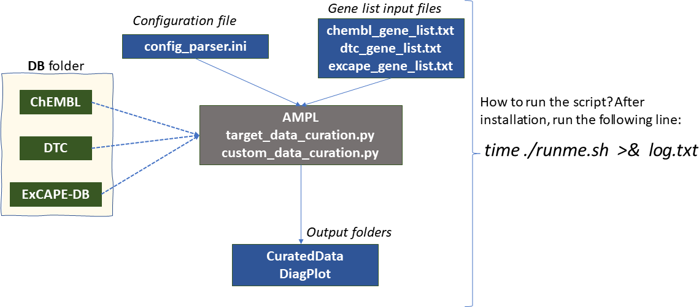

# ATOM Modeling Pipeline (AMPL) target-specific bulk database(s) download script

 

## Scope and details of the script

The script automates protein-ligand binding data download for a custom list of targets (protein) from databases such as ChEMBL (https://www.ebi.ac.uk/chembl/), Drug Target Commons (DTC; https://drugtargetcommons.fimm.fi/), and ExCAPE-DB (https://solr.ideaconsult.net/search/excape/) etc. The script also creates 
machine-learning ready datasets (combined and individuval) along with some basic Exploratory Data Analysis plots. 

Please note that the Python scripts has been developed to exploit Python Object Oriented Programming concepts. We envision users to bring in databases of their choice or use other information from the ones refered here (ChEMBL, DTC and/or ExCAPE-DB). Please look at the `custom_data_curation.py` 

Users with some effort can add -need Python programming- other input databas sources by extending the code.   
(Add a point to indicate that the new users can use OOP to expand the sections to add other DB sources; to be added)

### Software requirements: 

AMPL installation. Plese check AMPL GitHub page for installation, https://github.com/ATOMconsortium/AMPL 

## File structure details of the sourceCuration tar file
* Python codes: `custom_data_curation.py`, `target_data_curation.py`
* Main driver input and configuration files: `runme.sh`, `config_parser.ini`
* Data input: `chembl_gene_list.txt`, `dtc_gene_list.txt`, `excape_gene_list.txt` 
* Output folders: `CuratedData`, `DiagPlot`

Here is a tree structure of the tar file:  
```     
MultipleSourceCurn/
├── [4.0K]  DB                                 # (EMPTY FOLDER, a place-holder for database files) 
├── [4.0K]  sourceCuration
│   ├── [4.0K]  CuratedData                    # output directory: Curated Data of all datasets  
│   ├── [4.0K]  DiagPlot                       # output directory: Diagnostic Plots 
│   ├── [  36]  chembl_gene_list.txt           # input gene list for ChEMBL DB extraction)
│   ├── [2.4K]  config_parser.ini              # Configuration file that contains all the other DB file path 
│   ├── [ 16K]  custom_data_curation.py
│   ├── [  24]  dtc_gene_list.txt              # input gene list for DTC DB extraction
│   ├── [ 83K]  runme.out                      # driver file output 
│   ├── [ 380]  runme.sh                       # driver file  
│   ├── [  24]  excape_gene_lst.txt            # input gene list for ExCAPE-DB extraction
│   ├── [2.3K]  priority_panel_ki.ini          
└── [ 33M]  sourceCuration.tar.gz
```

Due to large DB directory size (~ 22 GB), its contents are not included in the MultipleSourceCurn.tar.gz file. 
After downloading MultipleSourceCurn.tar.gz, use `tar -xzvf MutipleSourceCurn.tar.gz`, to untar/unzip the 
file. This will create `MultipleSourceCurn` folder. Please download the concerned files and place them under the 
DB folder. Make sure the filenames match the filenames listed in the `priority_panel_ki.ini` file

```
MultipleSourceCurn
├── [4.0K]  DB
    ├── [2.1G]  DTC_data.csv          # Drug Data Commons (DTC) data 
    ├── [ 95M]  inchikey_smiles.csv   # DTC InChi to SMILES mapping list
    ├── [ 18G]  pubchem.chembl.dataset4publication_inchi_smiles.tsv  # ExCAPE-DB
    ├── [2.1G]  uid2cact.json         # ChEMBL DB 
    └── [557K]  uid2gn_human.json     # ChEMBL DB
```

### Instructions for running the script:
* Install AMPL 
* Download the tar file, `MultipleSourceCurn.tar.gz`
* Unar/unzip the file using `tar -xzvf MultipleSourceCurn.tar.gz`
* It will create MultipleSourceCurn folder with two sub-folders, `DB` and `sourceCuration`
   * `DB` folder files, due to large size, will not be included in the tarball 
   * Users have to download data from the datasources of their interest, such as DTC, ExCAPE-DB. Downloading the whole DTC and ExCAPE-DB files are straight-forward. Please see below for details. Please note that extracting the whole DB from ChEMBL needs some effort. Please check ChEMBL database link shown below for details:
      * https://chembl.gitbook.io/chembl-interface-documentation/frequently-asked-questions/chembl-download-questions
      * https://ftp.ebi.ac.uk/pub/databases/chembl/ChEMBLdb/latest/
* Once the concerned database files are placed in the DB folder 
* Open a terminal and activate atomsci package using the following command, `conda activate atomsci`
* Change directory to `MultipleSourceCurn/sourceCuration` and do the following things: 
  - Edit the configuration file, `priority_panel_ki.ini` to set the absolute path to `DB` folders. Also the configuration `end_points` section could be expanded to include `Ki,Kd,IC50,AC50,EC50`
  - Make sure to include protein targets of your choice. Please note that differnt databases have different convention for using different style for gene names. 
    * ChEMBL gene list should follow the naming convention as shown in `chembl_gene_list.txt`
    * DTC gene list should follow the naming convention as shown in `dtc_gene_list.txt` 
    * ExCAPE-DB gene list should follow the naming convention as shown `excape_gene_list.txt`
* After completing the above mentioned steps, run the following script
  - `./runme.sh >& log.out` 
  

## DB directory details: 

* **CuratedData** : Directory location to put combined model ready dataset and rejected compounds.
* **DiagPlot**  : Location to put diagnostic data 
    * currently will contain just distribution of activity values for final set

## Test run: 
Python code was tested for single and multiple protein targets along with different choices 
for the accumulation assay data type (ki, IC50 etc.)  

Here are some details on computational time for a test set of 3 protein targets, CASP9, KCNH2 and CYP3A4 with 
three end_points (ChEMBL definition;  ) IC50, Ki and EC50 and three data sources, DTC, ExcapeDB and ChEMBL. 

System tested: Google Cloud Platform (GCP), Intel Haswell CPU with 4vCPUs and 100GB memory. 
Peak memory usuage was ~80 GB. Here is the time to extract and curate data.

```
real    51m49.211s
user    50m9.502s
sys     0m59.148s
```

## Guidelines on how to extract data (the contents for `DB` database folder) from the databases

### ExCAPE-DB

Visit Excape download site, https://zenodo.org/record/2543724#.YMtnGahKguU,
and download the latest dataset. The dataset file will be a xz format compressed file. 
To uncompress, use the following command: 
(At the time of download, v2 was available; please check the downloaded file and replace the 
filename accordingly)
xz -d pubchem.chembl.dataset4publication_inchi_smiles_v2.tsv.xz 

Warning: the uncompressed file could take upto ~20 GB. 

Here is how you can extract a single target (ex. HTR3A) related data using the following Linux shell command,
```
awk -F'\t' '$9 == "HTR3A"'  pubchem.chembl.dataset4publication_inchi_smiles.tsv > temp
```
### DTC

Visit http://drgutargetcommons.fimm.fi/ and download the whole dataset. Here is a first few lines of the dataset

```
(atomsci) jupyter@ampl-ravi:~/MultipleSourceCurn/DB$ head DTC_data.csv

compound_id,standard_inchi_key,compound_name,synonym,target_id,target_pref_name,gene_names,wildtype_or_mutant,mutation_info,pubmed_id,standard_type,standard_relation,standard_value,standard_units,activity_comment,ep_action_mode,assay_format,assaytype,assay_subtype,inhibitor_type,detection_tech,assay_cell_line,compound_concentration_value,compound_concentration_value_unit,substrate_type,substrate_relation,substrate_value,substrate_units,assay_description,title,journal,doc_type,annotation_comments
CHEMBL3545284,"",CERDULATINIB,,Q9Y4K4,MITOGEN-ACTIVATED PROTEIN KINASE KINASE KINASE KINASE 5,MAP4K5,,,29191878,KDAPP,=,19155.14,NM,,inhibition,cell_free,binding,binding_reversible,"",label_free_technology,"K-562, COLO 205, MV-4-11, SK-N-BE(2)",3-30,NM-UM,,,,,LC-MS/MS BASED KINOBEADS COMPETITIVE PULL-DOWN ASSAY,THE TARGET LANDSCAPE OF CLINICAL KINASE DRUGS,SCIENCE,,
CHEMBL3545284,"",CERDULATINIB,,Q9Y478,"AMP-ACTIVATED PROTEIN KINASE, BETA-1 SUBUNIT",PRKAB1,,,29191878,KDAPP,=,1565.72,NM,,inhibition,cell_free,binding,binding_reversible,"",label_free_technology,"K-562, COLO 205, MV-4-11, SK-N-BE(2)",3-30,NM-UM,,,,,LC-MS/MS BASED KINOBEADS COMPETITIVE PULL-DOWN ASSAY,THE TARGET LANDSCAPE OF CLINICAL KINASE DRUGS,SCIENCE,,

```

### ChEMBL 

* Visit, https://ftp.ebi.ac.uk/pub/databases/chembl/ChEMBLdb/latest/ and download the MySQL data and convert the database 
into the input JSON file 

The two json files contain information about binding data for different ChEMBL assays and UniProt entry name to gene name mapping.

`uid2gn_human.json`: Here are the first few lines of the file. This file can be downloaded from UniProt webbrowser
```
	uniprot_entry_name	gene_names
0	1433B_HUMAN	         YWHAB
1	1433E_HUMAN	         YWHAE
2	1433F_HUMAN	         YWHAH
3	1433G_HUMAN	         YWHAG
4	1433S_HUMAN	         SFN
```

uid2catn.json 

```
	chemicals	                     smiles	                             pChEMBL	activity	relation	unit	    assay_id	type
0	None_CHEMBL117286	Oc1ccc(-c2cc(-c3ccc(O)cc3)cc(-c3ccc(O)cc3)c2)cc1	7.10	80.0	            =	         nM	  CHEMBL658311	  EC50
1	None_CHEMBL66511	COc1ccc(-c2cccc(-c3ccc(OC)cc3)c2)cc1	                 NaN	10000.0	            >	         nM	  CHEMBL658311	  EC50
2	None_CHEMBL66279	Oc1ccc(-c2cccc(-c3ccc(O)cc3)c2)cc1	                6.10	800.0	            =	         nM	  CHEMBL658311	  EC50
3	None_CHEMBL116918	Oc1ccc(-c2ccc(-c3ccc(O)cc3)cc2)cc1	                5.92	1200.0	            =	         nM	  CHEMBL658311	  EC50
4	None_CHEMBL113704	CC1C(=O)c2cc(O)ccc2OC1c1ccc(O)cc1	                8.40	4.0	            =	         nM	  CHEMBL658311	  EC50
```

If you have any questions or comments, please raise them via AMPL Issues link, https://github.com/ATOMconsortium/AMPL/issues
